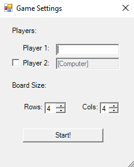
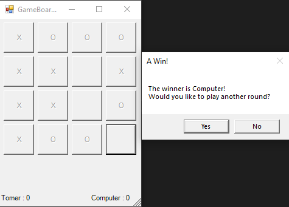

# Reverse-Tic-Tac-Toe

WinForm application using C# .NET and OOP to make a uniqe game of tic tac toe 
where the winner is the one that doesn't have a row at the end.

in the app:
1. Choose the amunt of players, 1 or 2. In the case of 1 the player,he will play aginest the computer.
2. Pick the board size.
3. The app will count the scores and announce the winner.

## Screenshots:
- Login page:

- Password Reset:

- Sign up/Register:

